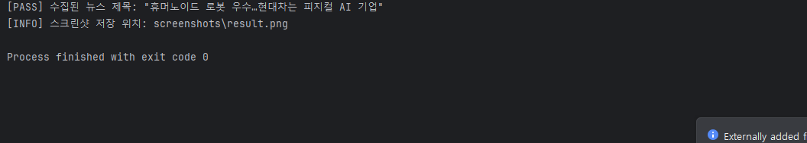
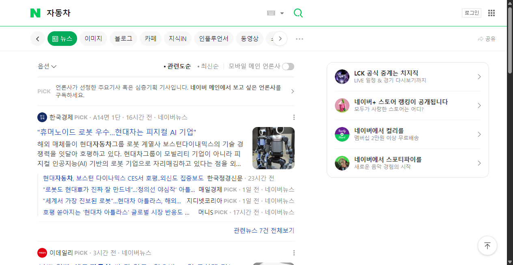

# Capture-and-Save

**Naver News Automation (Practice)
소개**

이 프로젝트는 Selenium을 이용한 웹 자동화 연습을 목적으로 만든 개인 실습 프로젝트입니다.
네이버 뉴스 검색 페이지에서 특정 키워드를 검색하고,
검색 결과 중 첫 번째 뉴스 제목을 가져오는 간단한 자동화 스크립트입니다.

## 사용 기술

* Python

* Selenium WebDriver

* webdriver-manager

* Chrome

## 주요 기능

* 네이버 뉴스 검색 페이지 자동 접속

* 키워드 검색 후 첫 번째 뉴스 제목 수집

* Explicit Wait을 사용한 요소 대기

* 실행 결과 스크린샷 저장

* Headless 모드 실행 가능

## 실행 결과

